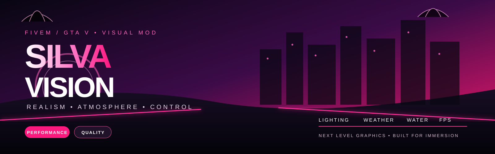

<p align="center">
  
</p>

<h1 align="center">SILVA VISION</h1>

<p align="center">
  <strong>FiveM / GTA V — visual enhancement project</strong><br>
  Realismo sem exagero.
</p>

<p align="center">
  <code>V0.5 DEV</code> · <code>PT-BR</code> · <code>BUILD AVANÇADA</code>
</p>

---

## 🎯 Objetivo

O **Silva Vision** é um projeto gráfico modular para FiveM/GTA V criado para entregar uma imagem mais realista, limpa, atmosférica e cinematográfica, mantendo controle de desempenho.

O projeto combina **ReShade + parâmetros nativos do ambiente + módulos visuais separados**, evitando depender de um único preset pesado.

**Foco:** iluminação · clima · atmosfera · água · reflexos · veículos · pós-processamento · desempenho.

---

## 🚧 Estado atual

| Componente | Estado |
|---|---|
| Arquitetura do projeto | ✅ definida |
| ReShade Silva Vision | ✅ avançado |
| Preset final | 🟡 em refinamento |
| Timecycle V0.4 | ✅ corrigido |
| White Lights | 🟡 adaptação |
| Weather | 🟡 adaptação |
| Water / Reflections | 🟡 adaptação |
| Atmosphere | 🟡 adaptação |
| Tunnel Lighting | 🟡 adaptação |
| visualsettings.dat | 🟡 análise/adaptação |
| RPF finais | 🟡 construção |
| Instalador | 🟡 preparação |
| Teste no FiveM | ⏳ fase final |
| Release estável | ⏳ ainda não lançado |

> **Importante:** nenhum componente é considerado estável apenas por compilar. A validação final precisa acontecer no FiveM real.

---

## 🧩 Arquitetura planejada

```text
silva-vision/
│
├── ReShade/
│   ├── SilvaVision_FINAL.ini
│   ├── Shaders/
│   └── Textures/
│
├── Citizen/
│   ├── visualsettings.dat
│   └── timecycle/
│
├── RPF/
│   ├── SilvaVision_WhiteLights.rpf
│   ├── SilvaVision_Weather.rpf
│   ├── SilvaVision_Water.rpf
│   ├── SilvaVision_Atmosphere.rpf
│   └── SilvaVision_Tunnel.rpf
│
├── presets/
├── core/
├── world/
├── tools/
├── docs/
├── assets/
└── .github/
```

---

## 🎨 Sistema visual

### ☀️ Dia

- iluminação natural;
- céu mais definido;
- contraste controlado;
- sombras sem esmagamento;
- cores vivas sem saturação artificial;
- highlights controlados.

### 🌇 Amanhecer / pôr do sol

- transições suaves;
- temperatura de cor progressiva;
- exposição adaptativa;
- atmosfera preservada;
- sem mudanças bruscas de iluminação.

### 🌙 Noite

- iluminação artificial branca;
- streetlights mais presentes;
- distant lights reforçadas;
- reflexos urbanos visíveis;
- sirenes destacadas;
- noite escura sem virar uma tela preta.

### 🌧️ Chuva

- partículas de chuva;
- iluminação afetada pela chuva;
- superfícies molhadas;
- reflexos de ruas;
- água/reflexos preservados;
- atmosfera de tempestade;
- controle para não transformar tudo em bloom.

### 🚗 Veículos

- headlights;
- brake lights;
- indicators;
- emissives;
- iluminação interior;
- sirenes/emergency lights;
- reflexos de carroceria.

### 🌫️ Atmosfera

- fog;
- haze;
- horizonte;
- nuvens;
- céu;
- volumetria controlada;
- iluminação atmosférica.

---

## 💡 White Lights

A iluminação noturna é uma das prioridades do projeto.

O alvo é uma iluminação artificial **branca e realista**, evitando a aparência excessivamente laranja/amarela encontrada em algumas configurações de referência.

Também serão tratados separadamente:

- streetlights;
- distant lights;
- coronas;
- reflexos;
- iluminação de túneis;
- iluminação artificial em interiores.

Os parâmetros de referência são **adaptados**, não copiados cegamente.

---

## 🌊 Água e superfícies

O módulo de água deve preservar e melhorar:

- reflexos;
- água distante;
- superfícies molhadas;
- puddles;
- reflexos urbanos;
- interação visual com chuva.

O princípio atual é **preservar reflexões úteis e evitar alterações agressivas que destruam o comportamento original da água**.

---

## 🌃 Timecycle

A V0.4 do timecycle já passou pela etapa de limpeza/adaptação.

### Mantido

- reflexões;
- iluminação artificial;
- parâmetros naturais de ambiente;
- melhorias específicas para túneis;
- iluminação noturna branca.

### Corrigido/controlado

- bounce light extremo;
- parâmetros exagerados de iluminação;
- bloom global agressivo;
- valores contextuais de emergência;
- multiplicadores extremos de luz.

### Regra

Valores extremos encontrados em outros projetos servem como **referência de pesquisa**, não como valores finais do Silva Vision.

---

## 🖥️ ReShade

A camada ReShade concentra principalmente o pós-processamento da imagem.

### Técnicas Silva Vision

1. RealismCore
2. Color
3. Tone
4. SunSky
5. WeatherAtmosphere
6. Ambient
7. AdaptiveLight
8. LightBalance
9. UrbanLight
10. NightEmergency
11. WetSurface
12. Reflection
13. Highlights
14. DetailVFX
15. DepthScreenSpace
16. VolumetricLighting
17. AdvancedWeather
18. VehicleMaterial
19. RealismDetail
20. Sharpen
21. Adaptation

A arquitetura evita duplicar funções pesadas sem necessidade. Exposição, adaptação, cor e tone mapping ficam organizados para impedir que várias etapas façam praticamente o mesmo trabalho.

---

## ⚡ Desempenho

O projeto possui quatro perfis:

| Perfil | Objetivo |
|---|---|
| **Performance** | jogar com maior margem de FPS |
| **Balanced** | equilíbrio entre imagem e desempenho |
| **Quality** | qualidade visual elevada |
| **Cinematic** | captura, screenshots e vídeo |

Efeitos caros, como AO baseado em profundidade, DOF e iluminação complexa, permanecem opcionais. A arquitetura de desempenho do projeto exige comparação A/B e benchmark antes de considerar uma alteração pronta. 

**Meta:** melhoria visual perceptível sem criar custo desnecessário.

---

## 🔬 Método de desenvolvimento

```text
PESQUISA
   ↓
SELEÇÃO DOS PARÂMETROS
   ↓
ADAPTAÇÃO SILVA VISION
   ↓
VALIDAÇÃO DE ESTRUTURA
   ↓
BUILD
   ↓
TESTE ISOLADO
   ↓
A/B + BENCHMARK
   ↓
CORREÇÃO
   ↓
INTEGRAÇÃO
   ↓
RELEASE
```

Nada é marcado como **FINAL/ESTÁVEL** somente porque o arquivo foi criado ou compilado.

---

## 🛡️ Regras do projeto

- preservar nomes de arquivos quando possível;
- não inventar formatos nativos;
- não alterar arquivos nativos sem validação;
- não copiar pacotes de terceiros indiscriminadamente;
- respeitar licenças dos projetos usados como referência;
- manter módulos experimentais separados;
- manter backup antes de alterações;
- evitar valores extremos;
- não duplicar efeitos desnecessariamente entre Citizen e ReShade;
- não prometer FPS sem benchmark;
- sempre prever rollback;
- validar no ambiente FiveM real antes do release.

---

## 📦 Plano de release

### V0.5

**Build visual avançada**

- White Lights;
- visualsettings;
- weather;
- water;
- atmosphere;
- tunnel lighting;
- integração ReShade;
- validações;
- relatórios.

### V0.6

**Integração e otimização**

- consolidação dos módulos;
- redução de duplicidade;
- ajustes de desempenho;
- testes A/B;
- correção dos problemas encontrados.

### V1.0

**Release estável**

Somente após teste real no FiveM e validação dos componentes.

---

## 📚 Documentação

- `docs/PERFORMANCE_ARCHITECTURE.md` — arquitetura de desempenho
- `docs/BENCHMARK_PROTOCOL.md` — protocolo de benchmark
- `docs/` — especificações, pesquisa, compatibilidade e testes
- `presets/` — perfis visuais

---

## 🏁 Filosofia

> **Silva Vision não é simplesmente aumentar brilho, saturação e bloom.**
>
> O objetivo é fazer o mundo parecer melhor iluminado, mais atmosférico e mais real sem destruir o visual original do GTA V.

---

<p align="center">
  <strong>SILVA VISION</strong><br>
  Realismo sem exagero.
</p>
